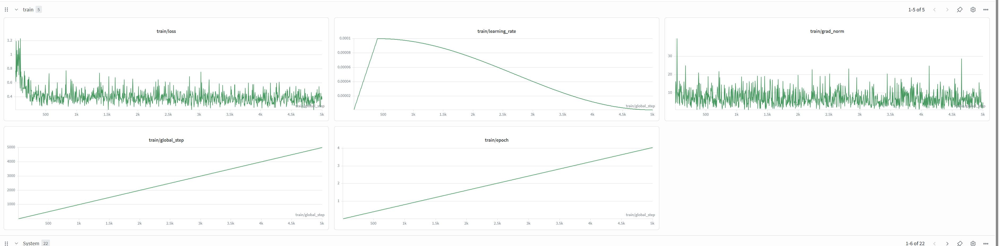

# Alpamayo-1 SFT

**The following examples were validated on 8× H100 GPUs with 80 GB each.**

This guide explains how to run supervised fine-tuning (SFT) for the Alpamayo-1 model on the
Physical AI AV dataset.

## Features

- [x] Stage 1: fine-tune the base VLM
- [x] Stage 2: fine-tune the expert trajectory diffusion model
- [x] Data loader support
  - PAI: [physical_ai_av](https://huggingface.co/datasets/nvidia/PhysicalAI-Autonomous-Vehicles)

## Prepare dataset and checkpoint

### Download the PAI dataset

You can download the full dataset, a subset by chunk, or individual components on demand.

Set your Hugging Face token first:

```bash
export HF_TOKEN=<your Hugging Face token>
```

Download a representative slice for Alpamayo-1 (chunks 0–10, four cameras, egomotion) running from `alpamayo-recipes`:

```bash
python scripts/download_pai.py \
  --chunk-ids 0-10 \
  --camera camera_front_wide_120fov camera_cross_left_120fov camera_cross_right_120fov camera_front_tele_30fov \
  --calibration camera_intrinsics sensor_extrinsics \
  --labels egomotion \
  --output-dir /path/to/pai_dataset
```

> `--chunk-ids` accepts a single id (`0`), multiple ids (`0 1`), or a range (`0-3`, which yields
> chunks 0, 1, and 2). Omit it (or pass `None`) to download the full dataset (~97 TB).

### Download the checkpoint

Download the pretrained Alpamayo-1 checkpoint from
[Hugging Face](https://huggingface.co/nvidia/Alpamayo-R1-10B) into a local directory (Stage 1
loads weights from disk):

```bash
huggingface-cli download nvidia/Alpamayo-R1-10B --local-dir <path/to/model>
```

All commands below should be run from **`alpamayo-recipes/recipes/alpamayo1_sft/`** with your virtual environment active.

Set `checkpoint_path` in [configs/models/ar1_base.yaml](configs/models/ar1_base.yaml), or pass
`model.checkpoint_path=<path>` on the command line when launching Stage 1 (see below).

## Run Stage 1 fine-tuning

> Alpamayo-1 uses Hydra, so you can extend or override configuration in a structured way.

> **Weights & Biases:** To log runs to W&B, uncomment the `wandb` default in
> [configs/sft_base.yaml](configs/sft_base.yaml), fill in `team` and `project` in
> [configs/wandb/default.yaml](configs/wandb/default.yaml), set `report_to: wandb` under
> `trainer`, and have your W&B API key available when training starts.

### Data loader

After downloading PAI, set `local_dir` in [configs/sft_base.yaml](configs/sft_base.yaml) to the dataset root and
`chunk_ids` to a range string such as `"0-10"` in your Hydra config or on the command line.

### Training stages

Training uses a two-stage pipeline for convergence and stability.

1. **Stage 1:** Fine-tune the VLM (`base_model`) to emit discrete trajectory tokens.
2. **Stage 2:** Freeze the Stage-1 VLM and train the action expert (trajectory diffusion) for
   continuous trajectories.

### Hyperparameters

Adjust settings such as `dataloader_num_workers` or the learning rate in the config as needed.

#### Stage 1

> Stage 1 fine-tunes the full VLM; DeepSpeed ZeRO-2 is enabled by default in the bundled config
> for memory-efficient multi-GPU training.

```bash
torchrun --nproc_per_node 8 \
  -m alpamayo1_sft.train_hf \
  --config-path pkg://alpamayo1_sft/configs \
  --config-name sft_stage1 \
  model.checkpoint_path=<path/to/Alpamayo-R1-10B> \
  data.train_dataset.local_dir=<path/to/pai_dataset> \
  data.val_dataset.local_dir=<path/to/pai_dataset>
```

`model.checkpoint_path` must be the local directory created with
`huggingface-cli download nvidia/Alpamayo-R1-10B …`.

Example log lines:

```
{'loss': 1.668, 'grad_norm': 0.9368, 'learning_rate': 1.25e-08, 'epoch': 0.02}
{'loss': 1.708, 'grad_norm': 1.1734, 'learning_rate': 2.50e-08, 'epoch': 0.03}
{'loss': 1.641, 'grad_norm': 0.8667, 'learning_rate': 3.75e-08, 'epoch': 0.05}
{'loss': 1.686, 'grad_norm': 0.8353, 'learning_rate': 5.00e-08, 'epoch': 0.06}
{'loss': 1.697, 'grad_norm': 1.1325, 'learning_rate': 6.25e-08, 'epoch': 0.08}
```

#### Stage 2

Stage 2 adds the trajectory diffusion expert and keeps the Stage-1 VLM frozen.

```bash
torchrun --nproc_per_node 8 \
  -m alpamayo1_sft.train_hf \
  --config-path pkg://alpamayo1_sft/configs \
  --config-name sft_stage2 \
  model.pretrained_model_name_or_path=<path/to/Alpamayo-R1-10B> \
  model.stage1_vlm_checkpoint_path=<path/to/output_stage1/checkpoint-xxxx> \
  data.train_dataset.local_dir=<path/to/pai_dataset> \
  data.val_dataset.local_dir=<path/to/pai_dataset>
```

> `model.pretrained_model_name_or_path` must be the same local folder used for Stage 1.
> `model.stage1_vlm_checkpoint_path` is your Stage 1 Trainer output directory, e.g.
> `output_stage1/checkpoint-3500` (contains `model.safetensors.index.json` and shards).

Loss curve:



### Evaluation

Evaluate the Stage-2 checkpoint against `val_dataset`:

```bash
torchrun --nproc_per_node 8 \
  -m alpamayo1_sft.evaluate_hf \
  --config-path pkg://alpamayo1_sft/configs \
  --config-name sft_stage2 \
  evaluate.eval_ckpt=<path/to/output_stage2/checkpoint-xxxx> \
  data.val_dataset.local_dir=<path/to/pai_dataset>
```

With the defaults above, `val/metric/min_ade` should fall below 1. Example metrics:

```
val/metric/ade              2.0072
val/metric/ade/by_t=3.0     0.3970
val/metric/corner_distance  0.6632
val/metric/min_ade          0.6270
val/metric/min_ade/by_t=0.5 0.0079
val/metric/min_ade/by_t=1.0 0.0261
val/metric/min_ade/by_t=3.0 0.2008
val/metric/min_ade/by_t=5.0 0.4351
```

## Note on example metrics and loss curves

The numbers and plots in this guide are provided **for validation and comparison only**. The
release model has already been trained on this data, so running the same fine-tuning recipe will
**not** show a large drop in loss relative to a from-scratch scenario. These references let you
confirm that your setup matches a **typical** fine-tuning run (logging shape, metric magnitudes,
and overall behavior).
